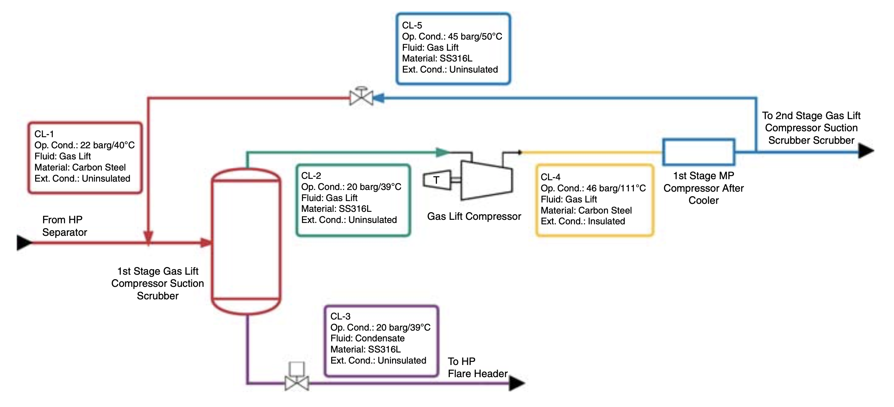
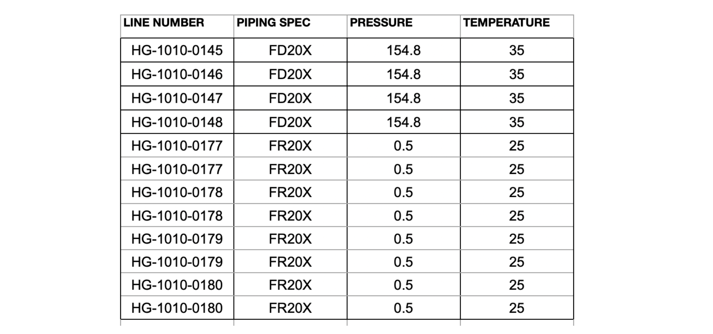
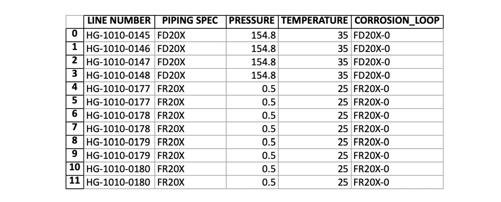

# Automated Corrosion Loop Development

## Introduction
This software implements the paper "Corrosion loop development of oil and gas piping system based on machine learning and group technology method" (see the paper [here](https://www.emerald.com/insight/content/doi/10.1108/JQME-07-2018-0058/full/html)). The aim is to develop an automated corrosion loop development system based on k-means clustering and group technology method. This system is expected to reduce the man-hours required develop corrosion loops. 



## Requirements
This system uses Python and Javascript as the main languages. The following have to be installed:
- [Python 3.5+](https://www.python.org/)
- [NodeJS 14.15.0+](https://nodejs.org/)
- [ReactJS 17.0.1+](https://reactjs.org/)

## Dependencies Installation 
```sh
git clone https://github.com/andikarachman/Automated-Corrosion-Loop-Development.git
cd Automated-Corrosion-Loop-Development
npm install
cd client
npm install
cd ..
pip3 install -r requirements.txt
```

## MongoDB
The login uses MongoDB. You should fill the MongoURI of your MongoDB instance in `./config/keys.js`.

## Run the System
From the root, run
```sh
npm start
```

## Input File
The input file is in Excel (.xlsx) with format as shown in the image below:



The first row is the name of the features included as the boundary requirements (e.g. operating pressure/temperature, material type, insulation type, etc.). There is no limitation on the number of features to be included in the analysis. The next rows are the values corresponding to the features. The input uses sheet with the name `Sheet 1` and starts from the `A1` cell. Other sheets should be empty.

## Output File
The output file is in Excel (.xlsx) with format as shown in the image below:



The corrosion loop name for each compnent is added in the last column. 


